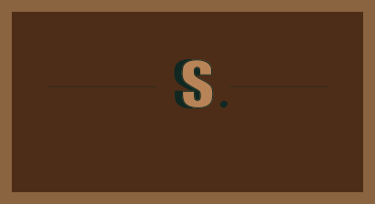

# Php_Project


---

# About Selah.

Selah is a religious Q&A website that helps users connect with others of the same belief and being in a community that understands and holds accountability. This website is purposefully designed like a social media platform to give users that sense of comfortablitity and familiarity to help them connect and embrace.

### Built With

[](https://www.w3.org/html/)
[](https://www.w3.org/Style/CSS/Overview.en.html)
[](https://getbootstrap.com/)
[](https://www.javascript.com/)
[](https://www.php.net/)
[](https://www.mysql.com/)
[](https://greensock.com/gsap/)
[](https://sass-lang.com/)
[](https://lesscss.org/)

.png>)

## How To Install

To get started, clone the repo:

```
Open https://github.com/Brilu-22/Php_Project.git in the Github Desktop
```

Once Opened check the structure of the folders

# Project Structure

## PHP_PROJECT...

- `htdocs/`
  - `ChurchWeb/`
    - `assets/`
    - `core/`
    - `DATABASE FILE`
    - `handle/`
    - `includes/`
    - `.htaccess`
    - `01 LOGIN DETAILS...`
    - ❤ `account.php`
    - `home.php`
    - `index.php`
    - ❤ `main.php`
    - `menu.html`
    - `JS/`
      - `menu.js`
    - `notification.php`
    - `profile.php`
    - `status.php`
    - `words.html`

## PAGES AND FUNCTIONALITY

| Page          | Description                                                                                                                                                                                                                |
| ------------- | -------------------------------------------------------------------------------------------------------------------------------------------------------------------------------------------------------------------------- |
| Login Page    | - Users are required to create accounts by signing up by clicking on the sign up button                                                                                                                                    |
|               | - login using their credentials to access the app                                                                                                                                                                          |
| Home Page     | - The structure resembles a social media platform giving the user flexibility and comfortablitity                                                                                                                          |
|               | - This page serves as a Questions and Answers page , where questions are viewed as posts and answers as comments, and clicking on the various message icon you can view the different questions/answers others have posted |
| Notifications | - This page for the signed in user where you can view comments and posts made by others                                                                                                                                    |
| Profile Page  | - This is where you as the signed in user can edit your profile and also view your recent posts and comments just like a social media platform                                                                             |
|               | - with suggested follows you can choose from                                                                                                                                                                               |
| Settings Page | - It also serves as an edit page where you can change your username and passwords                                                                                                                                          |

|

## Website Concept

When we had the group meeting and we had a brainstorming session of the type of Q&A website we were trying to go for , we came to discussing how it would be great to have it as a type of social media platform and that's how the concept of Selah Encrypted. Religion Decrypted looking like TikTok,Twitter and Instagram came from.



## UI Design

### Splash Screen (PreLoader)

.png>)

### Splash Screen 1

.png>)

### Login

.png>)

### Homepage

.png>)

### Profile Page

.png>)

## Development Process

### Important Notice

- Important thanks to the countless YouTubers and their videos that helped me reach this point of succession , @Coding Shiksha and countless others

### Succession Processes

- The intended functionality of the code works , even though there are some cracks it code produces the intended outcomes

### C.R.U.D Functionality

- Create - Users can create posts and comments.
- Read - The read functionality works at it's best , where read requests are given even though there seems to be some hiccups, but for the most part it words.
- Update - Users can update/edit profiles and change their user ids in the settings page.
- Delete - When it comes to the delete functionality, the code for the delete is there but unfortunately it's currently not working but the functionality "is there".

## Challenges

- main Challenge would have to be working with a different DBMS from last term so some things I had to learn again
- New DBMS = New Problems, The database kept on crashing and giving all sorts of errors , which consumed a lot of my time and productivity.
- Since it's also the first time I'm working with php at times my code would give some complicated and non-understandable errors ( still does , hence some of my functionality is screwed ).

## Future Solutions

- Take more time learning the database and language
- Don't take too much time with animations and making the website look cool
- Add the ability for all users to fully see everyones comment , and creating different communities for different topics to make it much easier for users to interact with the website.
- Also gsap isn't for everyone ( I learnt the hard and long way )

## Mockups

### Profile Mockup

.jpg>)

### Community Page Mockup

.jpg>)

### Individual Post Page Mockup

.jpg>)

### Home Page Mockup

.jpg>)

### Home Page Mockup

.jpg>)

## Demonstration

[Link To Demonstration Video](https://drive.google.com/file/d/1HA6-BJldasGiRjYhBErdbAy9Jyi7NVxT/view?usp=sharing)

### License

[MIT](LICENSE) © Lebogang Brilu Zechaniah Hlongwane
